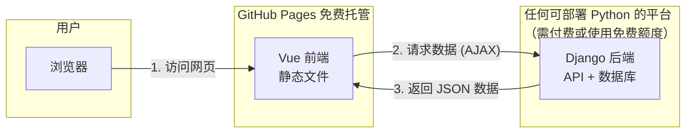

cd C:\Shares\Coding\EqWizard_03

@'
# EqWizard 投資交易系統

## 系統架構
- 後端：Django 6.0 + Django REST Framework
- 前端：Vue 3 + Vite + Pinia
- 資料庫：SQLite（開發）/ PostgreSQL（生產）

## 快速啟動

### 後端啟動
```bash
cd backend
python -m venv venv
.\venv\Scripts\activate
pip install -r requirements.txt
python manage.py migrate
python manage.py createsuperuser
python manage.py runserver


### 7. 建立 requirements.txt

```powershell
cd C:\Shares\Coding\EqWizard_03\backend

# 導出所有依賴套件
pip freeze > requirements.txt

# 查看內容
Get-Content requirements.txt


echo "# api" >> README.md
git init
git add README.md
git commit -m "first commit"
git branch -M main
git remote add origin https://github.com/YPHoldingsTW22/api.git
git push -u origin main


*****GitHub Pages正是托管这类**静态前端页面**的绝佳选择，它完全免费。不过需要明确一点：你之前搭建的**Django后端必须另外找地方托管**，不能放在GitHub Pages上。

简单来说，GitHub Pages只能托管由HTML、CSS、JS组成的静态文件，无法运行Python或执行数据库操作。

### 🔄 托管后的系统架构

把前端搬到GitHub Pages后，你的系统架构会变成下面这样：



这种“前后端分离”的架构正是Vue和Django这类框架设计的初衷，也是现代Web开发的主流模式。

### 🚀 如何将Vue前端部署到GitHub Pages

要把Vue项目部署上去，需要对项目做一些配置和调整，核心步骤如下：

1.  **配置`vite.config.js`**
    你需要告诉Vite，项目将来要放在哪个“子路径”下。

    *   **场景一：使用用户站点 ( `https://你的用户名.github.io/` )**
        这种模式下，你的网站会直接位于根域名下。
        ```javascript
        // vite.config.js
        import { defineConfig } from 'vite'
        import vue from '@vitejs/plugin-vue'

        export default defineConfig({
          plugins: [vue()],
          base: '/', // 如果是用户站点，直接使用根路径
        })
        ```

    *   **场景二：使用项目站点 ( `https://你的用户名.github.io/你的仓库名/` )**
        这是更常见的情况，你的前端代码会单独放在一个仓库里。
        ```javascript
        // vite.config.js
        import { defineConfig } from 'vite'
        import vue from '@vitejs/plugin-vue'

        export default defineConfig({
          plugins: [vue()],
          base: '/你的仓库名/', // 这里必须和你的GitHub仓库名一致，注意前后的斜杠
        })
        ```

2.  **配置Vue Router**
    这是最关键的一步，目的是解决页面刷新后出现`404`的问题。

    *   **推荐方案：使用hash模式**
        这是最简单、最稳妥的方式。URL里会多一个`#`号，但不会有`404`问题。
        ```javascript
        // src/router/index.js
        import { createRouter, createWebHashHistory } from 'vue-router'

        const router = createRouter({
          history: createWebHashHistory(), // 使用 hash 模式
          routes, // 你的路由规则
        })
        ```

    *   **进阶方案：使用history模式**
        这种模式的URL更美观，但需要额外的配置。你需要在项目的`public`目录下创建一个`404.html`文件，并在其中加入一段重定向脚本，让所有找不到的页面都回到`index.html`，由Vue Router接管。

3.  **自动化部署**
    每次代码更新后，手动构建并上传很麻烦。利用 **GitHub Actions** 可以实现自动化：当你把代码推送到GitHub仓库时，系统会自动帮你完成构建并发布。

    在你的Vue项目根目录下，创建文件：`.github/workflows/deploy.yml`，并填入以下内容：
    ```yaml
    name: Deploy Vue app to GitHub Pages

    on:
      push:
        branches: [ "main" ] # 当推送到 main 分支时触发

    permissions:
      contents: write

    jobs:
      deploy:
        runs-on: ubuntu-latest
        steps:
          - uses: actions/checkout@v3
          - uses: actions/setup-node@v3
            with:
              node-version: '18'
          - name: Install dependencies
            run: npm ci
          - name: Build project
            run: npm run build # 这个命令会生成 dist 文件夹
          - name: Deploy to GitHub Pages
            uses: peaceiris/actions-gh-pages@v3
            with:
              github_token: ${{ secrets.GITHUB_TOKEN }}
              publish_dir: ./dist
    ```

4.  **启用GitHub Pages**
    配置完成后，把代码推送到GitHub仓库。

    *   进入你的GitHub仓库，点击 **Settings**。
    *   在左侧菜单找到 **Pages**。
    *   在 **Build and deployment** 部分，将 **Source** 选为 **Deploy from a branch**。
    *   在 **Branch** 下拉菜单中，选择 `gh-pages` 分支（这是`peaceiris/actions-gh-pages`插件默认推送的分支），然后点击 **Save**。
    *   稍等片刻，你就能在Pages设置页面看到网站的访问链接了。

### ⚠️ 重要提醒：你的后端API怎么办？

前端部署到GitHub Pages后，它不知道自己该去哪里寻找后端。你需要在前端代码里，告诉它后端的地址。

*   **开发环境**：使用 `vite.config.js` 中的代理，这你已经很熟悉了。
*   **生产环境**：你需要创建一个`.env.production`文件，设置一个环境变量来指向你最终部署的后端地址。

    ```dotenv
    # .env.production
    VITE_API_BASE_URL=https://你的后端部署地址.com/api
    ```

    然后在你的前端代码（例如 `src/api/index.js`）中这样使用：
    ```javascript
    const api = axios.create({
      baseURL: import.meta.env.VITE_API_BASE_URL,
    })
    ```

    **关于后端的部署位置**：
    *   不能放在GitHub Pages。
    *   可以选择其他云平台，比如**阿里云、腾讯云**（需付费），或者**Railway、Render、Fly.io**等提供免费额度的PaaS平台，你可以根据自己的需求灵活选择。

### 💎 总结与建议

1.  **推荐组合**：用 **GitHub Pages** 托管Vue前端，享受快速、免费的CDN加速和版本控制。
2.  **关键配置**：记住要设置好Vue的`base`路径，并使用**hash模式**来解决刷新404的问题。
3.  **后端处理**：你的Django后端需要部署到其他支持Python的云平台上。

这个方案将你的应用完美地拆分成了前后端两个独立的、可独立部署和扩展的服务，是非常成熟的实践路径。如果对具体的某个步骤，比如编写GitHub Actions配置文件有疑问，随时可以再问我～


內外端 都在本地服務器上....
很好！你有固定 IP 伺服器，這讓部署變得很簡單。以下是完整的設定方案。

## 一、整體架構

```
Internet
   │
   └── 114.34.157.56 (固定IP伺服器)
         │
         ├── Django 後端 API (port 8000)
         │
         └── Vue 前端靜態檔案 (由 Nginx 託管，port 80/443)
```

**說明**：
- 前後端放在**同一台伺服器**上，簡化部署
- 前端透過 Nginx 直接提供靜態檔案
- 後端 API 透過 Nginx 反向代理或直接存取

---

## 二、後端設定 (Django)

### 1. 修改 `backend/.env` 或 `settings.py`

```bash
# backend/.env

DJANGO_SECRET_KEY=你的正式密鑰
DEBUG=False   # 正式環境關閉除錯模式

# 允許的連線來源
ALLOWED_HOSTS=114.34.157.56,192.168.200.140,localhost,127.0.0.1

# CORS 設定（允許前端域名）
CORS_ALLOWED_ORIGINS=https://114.34.157.56,http://114.34.157.56,http://localhost:5173
```

### 2. 修改 `backend/backend/settings.py`

```python
# 正式環境設定
DEBUG = os.environ.get('DEBUG', 'False') == 'True'

# 靜態檔案收集
STATIC_URL = '/static/'
STATIC_ROOT = BASE_DIR / 'staticfiles'

# 媒體檔案（如有上傳功能）
MEDIA_URL = '/media/'
MEDIA_ROOT = BASE_DIR / 'media'

# 安全設定（正式環境）
if not DEBUG:
    SECURE_SSL_REDIRECT = False  # 如沒有 SSL 憑證設 False
    SESSION_COOKIE_SECURE = False
    CSRF_COOKIE_SECURE = False
```

### 3. 收集靜態檔案

```bash
cd backend
python manage.py collectstatic
```

---

## 三、前端設定 (Vue)

### 1. 建立環境設定檔

**開發環境** `frontend/.env.development`：
```bash
# 開發環境使用本地代理
VITE_API_BASE_URL=/api
```

**正式環境** `frontend/.env.production`：
```bash
# 正式環境直接指向伺服器 IP
VITE_API_BASE_URL=http://114.34.157.56:8000/api
```

### 2. 修改 `frontend/src/api/index.js`

```javascript
import axios from 'axios'

// 使用環境變數決定 API 位置
const api = axios.create({
  baseURL: import.meta.env.VITE_API_BASE_URL || '/api',
  timeout: 30000,
})

// 請求攔截器（自動帶 Token）
api.interceptors.request.use(
  (config) => {
    const token = localStorage.getItem('token')
    if (token) {
      config.headers.Authorization = `Token ${token}`
    }
    return config
  },
  (error) => Promise.reject(error)
)

export default api
```

### 3. 修改 `vite.config.js`

```javascript
import { defineConfig } from 'vite'
import vue from '@vitejs/plugin-vue'

export default defineConfig({
  plugins: [vue()],
  base: '/',  // 放在根目錄
  server: {
    port: 5173,
    proxy: {
      '/api': {
        target: 'http://localhost:8000',
        changeOrigin: true,
      }
    }
  }
})
```

### 4. 修改路由為 hash 模式（避免刷新 404）

```javascript
// frontend/src/router/index.js
import { createRouter, createWebHashHistory } from 'vue-router'

const router = createRouter({
  history: createWebHashHistory(),  // 使用 hash 模式
  routes,
})
```

### 5. 建置前端

```bash
cd frontend
npm run build
```

會產生 `frontend/dist/` 目錄，包含所有靜態檔案。

---

## 四、伺服器設定 (Nginx)

### 安裝 Nginx (Ubuntu/Debian)

```bash
sudo apt update
sudo apt install nginx
```

### 建立 Nginx 設定檔 `/etc/nginx/sites-available/eqwizard`

```nginx
server {
    listen 80;
    server_name 114.34.157.56;
    
    # 前端靜態檔案
    root /var/www/eqwizard/frontend/dist;
    index index.html;
    
    # 處理 Vue 路由（hash 模式其實不需要，但保留無妨）
    location / {
        try_files $uri $uri/ /index.html;
    }
    
    # 後端 API 反向代理
    location /api/ {
        proxy_pass http://127.0.0.1:8000/api/;
        proxy_set_header Host $host;
        proxy_set_header X-Real-IP $remote_addr;
        proxy_set_header X-Forwarded-For $proxy_add_x_forwarded_for;
        proxy_set_header X-Forwarded-Proto $scheme;
    }
    
    # Django Admin 反向代理
    location /admin/ {
        proxy_pass http://127.0.0.1:8000/admin/;
        proxy_set_header Host $host;
        proxy_set_header X-Real-IP $remote_addr;
    }
    
    # 靜態檔案快取
    location ~* \.(jpg|jpeg|png|gif|ico|css|js|svg|woff|woff2)$ {
        expires 1y;
        add_header Cache-Control "public, immutable";
    }
}
```

### 啟用設定

```bash
# 建立軟連結
sudo ln -s /etc/nginx/sites-available/eqwizard /etc/nginx/sites-enabled/

# 移除預設網站（可選）
sudo rm /etc/nginx/sites-enabled/default

# 測試設定
sudo nginx -t

# 重載 Nginx
sudo systemctl reload nginx
```

---

## 五、使用 Gunicorn 執行 Django（正式環境）

### 1. 安裝 Gunicorn

```bash
cd backend
source venv/bin/activate
pip install gunicorn
```

### 2. 測試 Gunicorn

```bash
gunicorn --bind 127.0.0.1:8000 backend.wsgi:application
```

### 3. 建立 systemd 服務 `/etc/systemd/system/eqwizard.service`

```ini
[Unit]
Description=EqWizard Django Application
After=network.target

[Service]
User=www-data
Group=www-data
WorkingDirectory=/var/www/eqwizard/backend
Environment="PATH=/var/www/eqwizard/venv/bin"
Environment="DJANGO_SETTINGS_MODULE=backend.settings"
ExecStart=/var/www/eqwizard/venv/bin/gunicorn --workers 3 --bind 127.0.0.1:8000 backend.wsgi:application

[Install]
WantedBy=multi-user.target
```

### 4. 啟動服務

```bash
sudo systemctl daemon-reload
sudo systemctl start eqwizard
sudo systemctl enable eqwizard
sudo systemctl status eqwizard
```

---

## 六、伺服器目錄結構建議

```
/var/www/eqwizard/
├── backend/
│   ├── backend/          # Django 專案設定
│   ├── orders/           # 訂單應用
│   ├── staticfiles/      # 收集的靜態檔案
│   ├── media/            # 使用者上傳檔案
│   ├── db.sqlite3        # 或使用 PostgreSQL
│   ├── manage.py
│   └── requirements.txt
├── frontend/
│   └── dist/             # Vue 建置後的檔案
├── venv/                 # Python 虛擬環境
└── logs/                 # 日誌檔案
```

### 部署命令

```bash
# 1. 複製檔案到伺服器
scp -r backend/ user@114.34.157.56:/var/www/eqwizard/
scp -r frontend/dist/ user@114.34.157.56:/var/www/eqwizard/frontend/

# 2. 設定權限
sudo chown -R www-data:www-data /var/www/eqwizard/
```

---

## 七、防火牆設定

### 在伺服器上開放連接埠

```bash
# Ubuntu (ufw)
sudo ufw allow 22/tcp      # SSH
sudo ufw allow 80/tcp      # HTTP
sudo ufw allow 443/tcp     # HTTPS（如有）
sudo ufw enable

# 或使用 iptables
sudo iptables -A INPUT -p tcp --dport 80 -j ACCEPT
sudo iptables -A INPUT -p tcp --dport 8000 -j ACCEPT  # 如直接暴露 API
```

---

## 八、前端連線測試

部署完成後，前端會透過以下方式連線：

| 環境 | API 位址 | 說明 |
|------|---------|------|
| 開發環境 | `/api` (proxy 到 localhost:8000) | 透過 Vite proxy |
| 正式環境 | `http://114.34.157.56:8000/api` | 直接連線 |

### 瀏覽器訪問

- 前端：`http://114.34.157.56`
- 後端 API：`http://114.34.157.56:8000/api/orders/`
- Django Admin：`http://114.34.157.56:8000/admin`

---

## 九、Nginx 直接提供前端（更簡潔）

如果希望前後端都透過 80 埠存取（不需要 :8000），可以讓 Nginx 同時處理前端靜態檔案和 API 反向代理：

```nginx
server {
    listen 80;
    server_name 114.34.157.56;
    
    # 前端
    location / {
        root /var/www/eqwizard/frontend/dist;
        try_files $uri $uri/ /index.html;
    }
    
    # 後端 API（不需要另外開 8000 埠）
    location /api/ {
        proxy_pass http://127.0.0.1:8000/api/;
        proxy_set_header Host $host;
    }
    
    location /admin/ {
        proxy_pass http://127.0.0.1:8000/admin/;
        proxy_set_header Host $host;
    }
}
```

這樣使用者只需要訪問 `http://114.34.157.56` 就能使用完整功能。

---

## 十、檢查清單

| 項目 | 指令/方法 | 預期結果 |
|------|---------|---------|
| Nginx 運作 | `sudo systemctl status nginx` | active (running) |
| Gunicorn 運作 | `sudo systemctl status eqwizard` | active (running) |
| 前端可訪問 | 瀏覽器 `http://114.34.157.56` | 看到登入畫面 |
| API 可訪問 | `curl http://114.34.157.56/api/orders/` | 返回 JSON |
| CORS 設定 | 瀏覽器開發者工具 → Network | 無 CORS 錯誤 |
| 靜態檔案 | 檢查圖片/CSS 是否正常載入 | 無 404 錯誤 |

這樣你的投資交易系統就完成正式部署了！


** 前端Github Pages 後端 Fixed IP @home.ASUS
明白了！你希望**前端放在 GitHub Pages**，**後端放在固定 IP 伺服器 (114.34.157.56)**。以下是完整的修正方案。

## 一、整體架構

```
Internet
   │
   ├── GitHub Pages (免費託管)
   │   └── Vue 前端靜態檔案
   │       └── https://YPHoldingsTW2.github.io/eqwizard/
   │
   └── 114.34.157.56 (你的固定IP伺服器)
       └── Django 後端 API (port 8000)
```

---

## 二、後端設定 (Django) - 放在 114.34.157.56

### 1. 修改 `backend/.env`

```bash
# backend/.env

DJANGO_SECRET_KEY=你的正式密鑰
DEBUG=False

# 允許的連線來源（包含 GitHub Pages 域名）
ALLOWED_HOSTS=114.34.157.56,192.168.200.140,localhost,127.0.0.1,YPHoldingsTW2.github.io

# CORS 設定（允許 GitHub Pages 前端存取）
CORS_ALLOWED_ORIGINS=https://YPHoldingsTW2.github.io,http://localhost:5173

# 如果需要多個前端域名
# CORS_ALLOWED_ORIGINS=https://YPHoldingsTW2.github.io,https://你的自訂域名.com
```

### 2. 修改 `backend/backend/settings.py`

```python
# CORS 設定
CORS_ALLOW_ALL_ORIGINS = False
CORS_ALLOWED_ORIGINS = os.environ.get('CORS_ALLOWED_ORIGINS', '').split(',')
CORS_ALLOW_CREDENTIALS = True

# 允許的請求方法
CORS_ALLOW_METHODS = ['GET', 'POST', 'PUT', 'PATCH', 'DELETE', 'OPTIONS']

# 允許的請求頭
CORS_ALLOW_HEADERS = ['accept', 'accept-encoding', 'authorization', 
                       'content-type', 'dnt', 'origin', 'user-agent', 
                       'x-csrftoken', 'x-requested-with']
```

### 3. 啟動後端（監聽所有介面）

```bash
cd backend
python manage.py runserver 0.0.0.0:8000
```

或使用 Gunicorn（正式環境）：
```bash
gunicorn --bind 0.0.0.0:8000 backend.wsgi:application
```

---

## 三、前端設定 (Vue) - 部署到 GitHub Pages

### 1. 建立環境設定檔

**開發環境** `frontend/.env.development`：
```bash
# 開發環境使用本地代理
VITE_API_BASE_URL=/api
```

**正式環境** `frontend/.env.production`：
```bash
# 正式環境指向固定 IP 伺服器
VITE_API_BASE_URL=http://114.34.157.56:8000/api
```

### 2. 修改 `frontend/src/api/index.js`

```javascript
import axios from 'axios'

// 使用環境變數決定 API 位置
const api = axios.create({
  baseURL: import.meta.env.VITE_API_BASE_URL || '/api',
  timeout: 30000,
})

// 請求攔截器
api.interceptors.request.use(
  (config) => {
    const token = localStorage.getItem('token')
    if (token) {
      config.headers.Authorization = `Token ${token}`
    }
    return config
  },
  (error) => Promise.reject(error)
)

export default api
```

### 3. 修改 `frontend/vite.config.js`

```javascript
import { defineConfig } from 'vite'
import vue from '@vitejs/plugin-vue'

export default defineConfig({
  plugins: [vue()],
  base: '/eqwizard/',  // 這裡放你的 GitHub 倉庫名稱
  server: {
    port: 5173,
    proxy: {
      '/api': {
        target: 'http://localhost:8000',
        changeOrigin: true,
      }
    }
  }
})
```

### 4. 修改路由為 hash 模式

```javascript
// frontend/src/router/index.js
import { createRouter, createWebHashHistory } from 'vue-router'

const router = createRouter({
  history: createWebHashHistory(),  // 使用 hash 模式
  routes,
})

export default router
```

### 5. 建置前端

```bash
cd frontend
npm run build
```

產生 `frontend/dist/` 目錄。

---

## 四、部署前端到 GitHub Pages

### 方法一：手動部署

```bash
# 1. 建置專案
npm run build

# 2. 進入 dist 目錄
cd dist

# 3. 初始化 Git 並推送到 gh-pages 分支
git init
git add .
git commit -m "Deploy to GitHub Pages"
git branch -M gh-pages
git remote add origin https://github.com/YPHoldingsTW2/eqwizard.git
git push -u origin gh-pages --force
```

### 方法二：自動部署 (GitHub Actions)

建立 `.github/workflows/deploy.yml`：

```yaml
name: Deploy to GitHub Pages

on:
  push:
    branches: [ main ]  # 當推送到 main 分支時觸發

jobs:
  build-and-deploy:
    runs-on: ubuntu-latest
    steps:
      - name: Checkout
        uses: actions/checkout@v3

      - name: Setup Node.js
        uses: actions/setup-node@v3
        with:
          node-version: '18'

      - name: Install dependencies
        run: npm ci

      - name: Build project
        run: npm run build
        env:
          VITE_API_BASE_URL: http://114.34.157.56:8000/api

      - name: Deploy to GitHub Pages
        uses: peaceiris/actions-gh-pages@v3
        with:
          github_token: ${{ secrets.GITHUB_TOKEN }}
          publish_dir: ./dist
          publish_branch: gh-pages
```

### 方法三：使用 GitHub Pages 內建功能

1. 在 GitHub 倉庫設定 → Pages
2. Source 選擇 `Deploy from a branch`
3. Branch 選擇 `gh-pages` 分支
4. 點擊 Save

---

## 五、GitHub Pages 設定

### 1. 確認 GitHub 倉庫設定

- 倉庫名稱：`eqwizard`（需與 `vite.config.js` 中的 `base` 一致）
- Pages 網址：`https://YPHoldingsTW2.github.io/eqwizard/`

### 2. 如果需要自訂域名

在 `frontend/public/` 下建立 `CNAME` 檔案：
```
www.yourdomain.com
```

並在 DNS 設定中加入 CNAME 記錄。

---

## 六、Nginx 設定（後端伺服器，僅需反向代理 API）

由於前端在 GitHub Pages，後端伺服器**不需要**托管前端檔案，只需提供 API 服務。

### 簡化的 Nginx 設定 `/etc/nginx/sites-available/eqwizard-api`

```nginx
server {
    listen 80;
    server_name 114.34.157.56;
    
    # 只處理 API 請求
    location /api/ {
        proxy_pass http://127.0.0.1:8000/api/;
        proxy_set_header Host $host;
        proxy_set_header X-Real-IP $remote_addr;
        proxy_set_header X-Forwarded-For $proxy_add_x_forwarded_for;
        proxy_set_header X-Forwarded-Proto $scheme;
    }
    
    location /admin/ {
        proxy_pass http://127.0.0.1:8000/admin/;
        proxy_set_header Host $host;
    }
    
    # 可選：API 根路徑返回資訊
    location / {
        return 200 '{"status": "API Server Running"}';
        add_header Content-Type application/json;
    }
}
```

### 啟用設定

```bash
sudo ln -s /etc/nginx/sites-available/eqwizard-api /etc/nginx/sites-enabled/
sudo nginx -t
sudo systemctl reload nginx
```

---

## 七、完整部署流程

### 後端伺服器 (114.34.157.56)

```bash
# 1. 複製後端程式碼
scp -r backend/ user@114.34.157.56:/var/www/eqwizard/

# 2. 安裝依賴並啟動
ssh user@114.34.157.56
cd /var/www/eqwizard/backend
python -m venv venv
source venv/bin/activate
pip install -r requirements.txt
python manage.py migrate
python manage.py collectstatic

# 3. 使用 Gunicorn 啟動
gunicorn --bind 0.0.0.0:8000 backend.wsgi:application &

# 或使用 systemd 服務（如前所述）
```

### 前端 (本地開發機)

```bash
# 1. 設定環境變數
echo "VITE_API_BASE_URL=http://114.34.157.56:8000/api" > .env.production

# 2. 建置
npm run build

# 3. 部署到 GitHub Pages
cd dist
git init
git add .
git commit -m "Deploy"
git push -f https://github.com/YPHoldingsTW2/eqwizard.git main:gh-pages
```

---

## 八、訪問網址

| 服務 | 網址 |
|------|------|
| **前端 (GitHub Pages)** | `https://YPHoldingsTW2.github.io/eqwizard/` |
| **後端 API** | `http://114.34.157.56:8000/api/orders/` |
| **Django Admin** | `http://114.34.157.56:8000/admin/` |

---

## 九、CORS 檢查清單

由於前後端不同源，CORS 設定非常重要：

| 檢查項目 | 設定值 |
|---------|--------|
| 前端網址 | `https://YPHoldingsTW2.github.io` |
| 後端網址 | `http://114.34.157.56:8000` |
| `CORS_ALLOWED_ORIGINS` | 必須包含 `https://YPHoldingsTW2.github.io` |
| 前端 API 呼叫 | `http://114.34.157.56:8000/api/...` |

### 測試 CORS

```bash
# 從瀏覽器開發者工具檢查
# 或在終端機測試
curl -H "Origin: https://YPHoldingsTW2.github.io" \
     -H "Access-Control-Request-Method: GET" \
     -X OPTIONS http://114.34.157.56:8000/api/orders/ -v
```

---

## 十、優化建議

### 1. 啟用 HTTPS（推薦）

- **GitHub Pages**：自動支援 HTTPS，無需設定
- **後端伺服器**：使用 Let's Encrypt 免費 SSL 憑證

```bash
sudo apt install certbot python3-certbot-nginx
sudo certbot --nginx -d 114.34.157.56
```

### 2. 更新前端環境變數（使用 HTTPS）

```bash
# .env.production
VITE_API_BASE_URL=https://114.34.157.56/api
```

### 3. 後端 CORS 更新

```python
CORS_ALLOWED_ORIGINS = [
    'https://YPHoldingsTW2.github.io',
    'https://114.34.157.56',  # 如使用 HTTPS
]
```

---

## 十一、常見問題排解

| 問題 | 解決方法 |
|------|---------|
| 前端無法連線後端 | 檢查 CORS 設定、後端防火牆 8000 埠 |
| GitHub Pages 顯示 404 | 檢查 `base` 設定是否與倉庫名一致 |
| 路由刷新後 404 | 使用 hash 模式 (`createWebHashHistory`) |
| 圖片/CSS 載入失敗 | 檢查 `base` 路徑設定 |

這樣你的前端就成功託管在 GitHub Pages，後端在固定 IP 伺服器上了！


git init
git add .
git commit -m "Deploy to GitHub Pages"
git branch -M gh-pages
git remote add origin https://github.com/ypholdingstw2/api.git
git push -u origin gh-pages --force


//2026.04.20
太好了！既然系统已经可以正常运行（登录、左侧菜单、功能占位页面），我们建立一个**更新记忆点**，方便后续继续开发时能够回退到当前稳定状态。

## 📌 记忆点操作指南（请执行以下任一种）

### 方式一：使用 Git 提交（推荐，最规范）

```bash
# 进入项目根目录
cd C:\Shares\Coding\EqWizard_03

# 查看当前修改状态
git status

# 将所有修改添加到暂存区
git add .

# 提交一个清晰的版本标签
git commit -m "MEMORY_POINT: 稳定版本 - 左侧菜单+10个功能占位+登录跳转修复"

# 可选：打一个轻量标签方便快速切换
git tag v0.1-stable
```

### 方式二：手动备份（无 Git 时使用）

1. 复制整个项目文件夹 `EqWizard_03` 到同目录下的备份文件夹，例如 `EqWizard_03_backup_20250420`。
2. 压缩备份文件夹留存。

---

## 📋 当前稳定状态的关键配置摘要

| 模块 | 文件 | 关键点 |
|------|------|--------|
| **路由** | `frontend/src/router/index.js` | ✅ 使用 `createWebHashHistory`<br>✅ 父路由 `/dashboard` 含子路由 `func1`…`func10`<br>✅ 添加了 `/func1` → `/dashboard/func1` 重定向（消除警告） |
| **布局** | `frontend/src/views/Dashboard.vue` | ✅ 左侧菜单 + 右侧内容区<br>✅ 菜单项 `path` 为绝对路径 `/dashboard/funcX`<br>✅ `filteredMenu` 支持管理员权限过滤 |
| **登录** | `frontend/src/views/Login.vue` | ✅ 跳转使用 `router.push('/dashboard')`<br>✅ 样式完整（渐变背景、卡片阴影） |
| **注册** | `frontend/src/views/Register.vue` | ✅ 注册成功后跳转 `/login` |
| **API** | `frontend/src/api/index.js` | ✅ 使用 `import.meta.env.VITE_API_BASE_URL`<br>✅ 开发环境代理 `/api` 到后端 |
| **环境变量** | `.env.development` | ✅ `VITE_API_BASE_URL=/api` |
| **构建** | `frontend/vite.config.js` | ✅ `base: '/'`（开发环境）<br>✅ 代理目标 `http://192.168.200.147:8000` |
| **后端** | `backend/backend/settings.py` | ✅ `ALLOWED_HOSTS` 包含内网 IP<br>✅ `CORS_ALLOWED_ORIGINS` 包含前端地址 |

---

## 🚀 后续开发建议

1. **每次新增功能前**，先执行 `git commit -m "WIP: 描述"` 保存当前进度。
2. **如果修改后出现问题**，可以快速回滚：
   ```bash
   git checkout v0.1-stable   # 回到记忆点
   ```
   或手动恢复备份文件夹。
3. **新增功能 API 时**，推荐在后端 `orders/views.py` 中新增 ViewSet，前端对应增加菜单项和组件。

---

## 📝 记录当前文件哈希（可选）

你可以运行以下命令生成当前所有核心文件的 MD5，以便未来校验是否被意外修改：

```powershell
Get-FileHash C:\Shares\Coding\EqWizard_03\frontend\src\router\index.js -Algorithm MD5
Get-FileHash C:\Shares\Coding\EqWizard_03\frontend\src\views\Dashboard.vue -Algorithm MD5
Get-FileHash C:\Shares\Coding\EqWizard_03\frontend\src\views\Login.vue -Algorithm MD5
# ... 其他重要文件
```

---

现在，你已经拥有一个可靠的**开发基准点**。接下来可以放心地增加新功能，随时可以回到这个稳定状态。祝你开发顺利！


在当前的 Vue + Django REST Framework 架构下，新增一个完整的功能模块（例如“产品管理”、“持仓分析”等），需要在前端和后端分别进行一系列操作。下面我按照开发顺序，详细列出需要增加或调整的**所有代码文件及具体内容**。

---

## 一、后端（Django）开发步骤

### 1. 定义数据模型（如果需要存储数据）
**文件**：`backend/orders/models.py`（或新建一个 app，但这里沿用 `orders` app）

```python
# 示例：新增一个 Product 模型
class Product(models.Model):
    name = models.CharField(max_length=100)
    code = models.CharField(max_length=20, unique=True)
    price = models.DecimalField(max_digits=10, decimal_places=2)
    created_at = models.DateTimeField(auto_now_add=True)

    def __str__(self):
        return self.name
```

然后运行：
```bash
python manage.py makemigrations
python manage.py migrate
```

### 2. 创建序列化器（Serializer）
**文件**：`backend/orders/serializers.py`

```python
from .models import Product

class ProductSerializer(serializers.ModelSerializer):
    class Meta:
        model = Product
        fields = '__all__'
```

### 3. 创建视图（ViewSet 或 APIView）
**文件**：`backend/orders/views.py`

```python
from .models import Product
from .serializers import ProductSerializer
from rest_framework import viewsets, permissions

class ProductViewSet(viewsets.ModelViewSet):
    queryset = Product.objects.all()
    serializer_class = ProductSerializer
    permission_classes = [permissions.IsAuthenticated]   # 需要登录
```

### 4. 注册路由
**文件**：`backend/orders/urls.py`

```python
from .views import ProductViewSet

router.register(r'products', ProductViewSet)   # 添加这行
```

此时后端 API 端点可用：
- `GET /api/products/` – 列表
- `POST /api/products/` – 创建
- `GET /api/products/{id}/` – 详情
- `PUT/PATCH /api/products/{id}/` – 更新
- `DELETE /api/products/{id}/` – 删除

### 5. 注册到 Admin 后台（可选）
**文件**：`backend/orders/admin.py`

```python
from .models import Product

@admin.register(Product)
class ProductAdmin(admin.ModelAdmin):
    list_display = ['name', 'code', 'price', 'created_at']
```

---

## 二、前端（Vue）开发步骤

### 1. 创建 API 调用模块
**文件**：`frontend/src/api/product.js`

```javascript
import api from './index'

export const productApi = {
  // 获取列表
  getProducts(params) {
    return api.get('/products/', { params })
  },
  // 获取单个
  getProduct(id) {
    return api.get(`/products/${id}/`)
  },
  // 创建
  createProduct(data) {
    return api.post('/products/', data)
  },
  // 更新
  updateProduct(id, data) {
    return api.patch(`/products/${id}/`, data)
  },
  // 删除
  deleteProduct(id) {
    return api.delete(`/products/${id}/`)
  }
}
```

### 2. 创建 Pinia Store（状态管理）
**文件**：`frontend/src/stores/product.js`

```javascript
import { defineStore } from 'pinia'
import { productApi } from '../api/product'

export const useProductStore = defineStore('product', {
  state: () => ({
    products: [],
    loading: false,
  }),
  actions: {
    async fetchProducts() {
      this.loading = true
      try {
        const res = await productApi.getProducts()
        this.products = res.data
        return { success: true, data: res.data }
      } catch (err) {
        return { success: false, message: err.message }
      } finally {
        this.loading = false
      }
    },
    async createProduct(data) {
      // 类似实现
    },
    // 其他 actions...
  }
})
```

### 3. 创建页面组件（View）
**文件**：`frontend/src/views/ProductList.vue`

```vue
<template>
  <div>
    <h2>產品列表</h2>
    <div v-if="store.loading">載入中...</div>
    <ul v-else>
      <li v-for="p in store.products" :key="p.id">
        {{ p.name }} - {{ p.price }}
      </li>
    </ul>
  </div>
</template>

<script setup>
import { onMounted } from 'vue'
import { useProductStore } from '../stores/product'

const store = useProductStore()
onMounted(() => {
  store.fetchProducts()
})
</script>
```

### 4. 添加路由
**文件**：`frontend/src/router/index.js`

在 `children` 数组中添加：

```javascript
{ path: 'products', name: 'ProductList', component: () => import('../views/ProductList.vue') }
```

### 5. 添加菜单项
**文件**：`frontend/src/views/Dashboard.vue`

在 `menuItems` 数组中添加：

```javascript
{ id: 15, label: '產品管理', path: '/dashboard/products', icon: '📦' }
```

### 6. 如果需要表单（新增/编辑），创建子页面
**文件**：`frontend/src/views/ProductForm.vue`，并在路由中配置为子路由。

---

## 三、权限控制（可选）

如果新功能需要特定权限（如只有管理员可访问），可以在后端视图设置：

```python
permission_classes = [permissions.IsAdminUser]
```

在前端菜单中根据 `isAdmin` 过滤（已在 `Dashboard.vue` 中实现 `adminOnly` 属性）。

---

## 四、开发顺序总结（推荐）

| 顺序 | 后端操作 | 前端操作 |
|------|---------|---------|
| 1 | 定义 Model | – |
| 2 | 执行 makemigrations/migrate | – |
| 3 | 编写 Serializer | – |
| 4 | 编写 ViewSet | – |
| 5 | 注册路由 | – |
| 6 | – | 创建 API 调用模块 |
| 7 | – | 创建 Store |
| 8 | – | 创建 View 组件 |
| 9 | – | 添加路由 |
| 10 | – | 添加菜单项 |
| 11 | 测试 API（用 curl 或浏览器） | 测试前端页面 |

---

## 五、快速代码模板（复制即用）

### 后端模板（ViewSet）
```python
class NewFeatureViewSet(viewsets.ModelViewSet):
    queryset = NewModel.objects.all()
    serializer_class = NewModelSerializer
    permission_classes = [permissions.IsAuthenticated]
```

### 前端模板（Store）
```javascript
export const useNewFeatureStore = defineStore('newFeature', {
  state: () => ({ data: [], loading: false }),
  actions: {
    async fetchData() {
      this.loading = true
      try {
        const res = await api.get('/new-feature/')
        this.data = res.data
      } finally { this.loading = false }
    }
  }
})
```

### 菜单项模板
```javascript
{ id: 99, label: '新功能', path: '/dashboard/new-feature', icon: '✨' }
```

---

按照这个清单，你可以系统性地增加任意新功能，保持代码结构清晰、可维护。如果新增功能需要复杂的业务逻辑（如报表、文件上传），再针对性地添加相应代码。